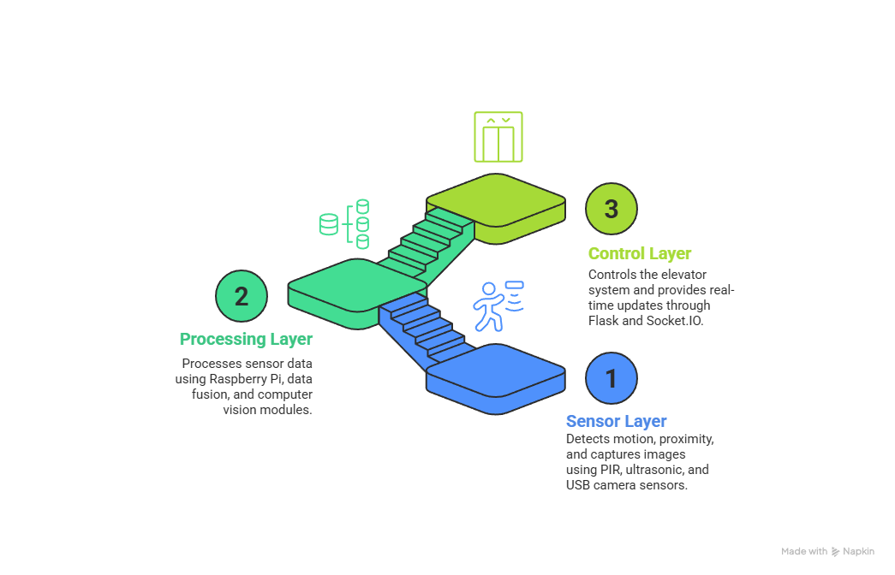
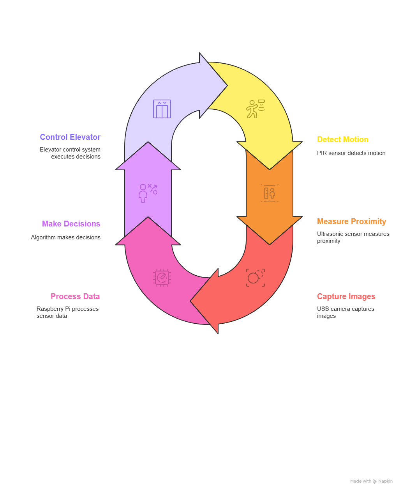
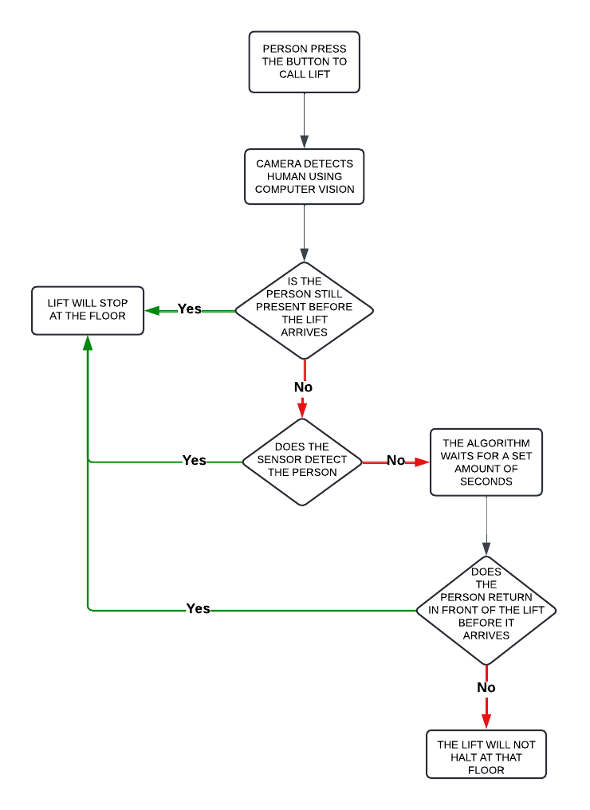
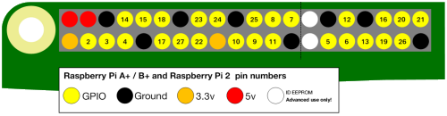
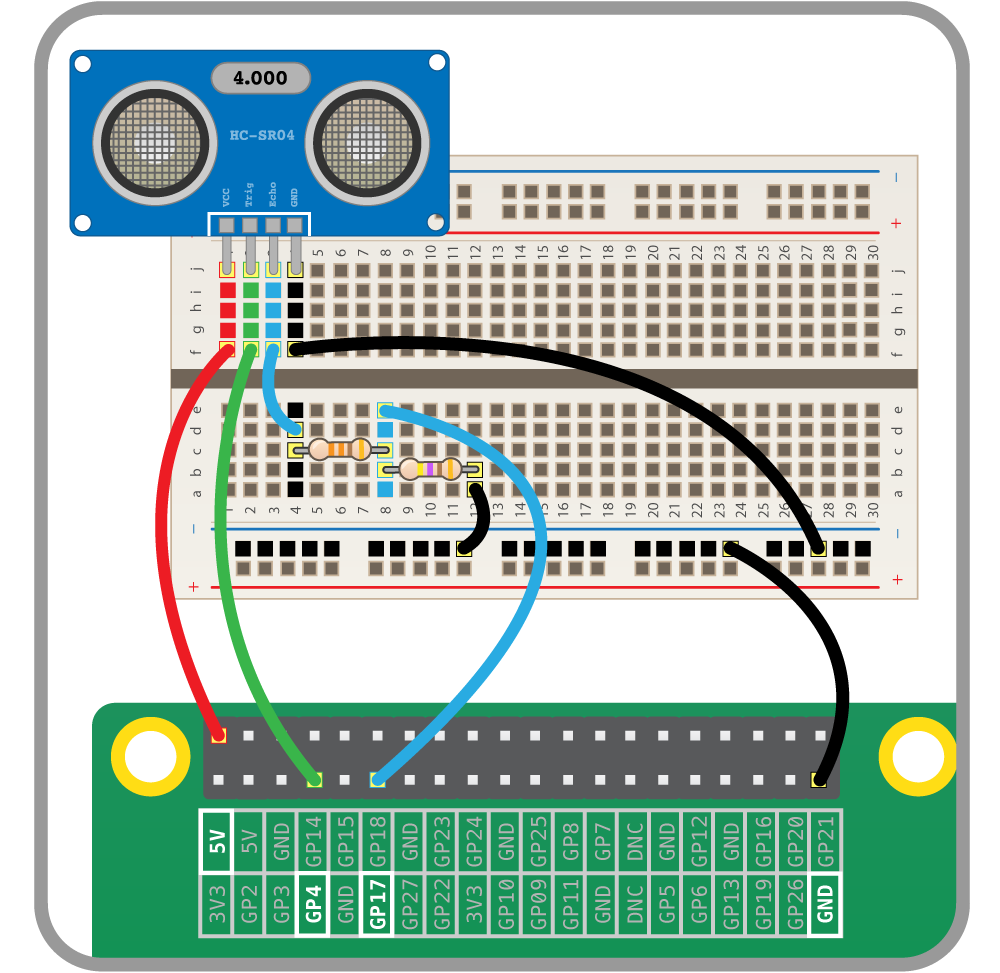
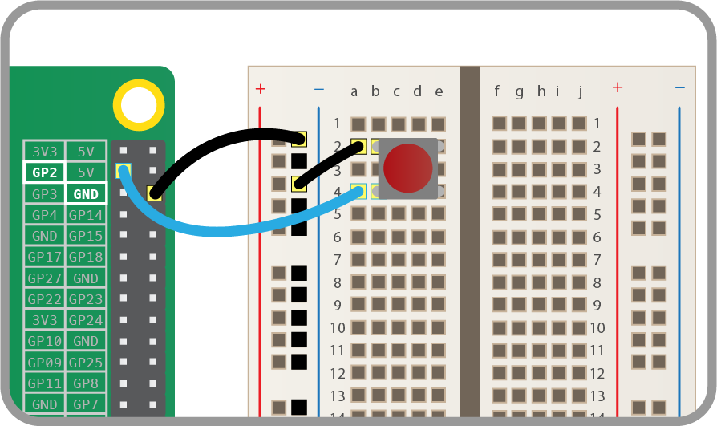

# Smart Elevator Automation System

## Overview

A Raspberry Pi 3 based elevator prototype that uses **sensor fusion** to
verify human presence before stopping at a floor, eliminating unnecessary
stops and reducing energy waste.

Three sensors vote on each detection event — the elevator opens its doors
**only when ≥ 2 of 3 sensors confirm a person is present**.

---

## System Architecture

### Layered Design



| Layer | Component | Role |
|---|---|---|
| Sensor | PIR, Ultrasonic, Webcam | Detect human presence |
| Processing | Raspberry Pi 3 | Sensor fusion + decision logic |
| Control | Flask + Socket.IO | Real-time web dashboard |

### Operational Cycle



---

## Flowchart



---

## Hardware & GPIO

### GPIO Pinout



### HC-SR04 Ultrasonic Sensor – Circuit



### Push Button – Circuit



### Full GPIO Mapping

| Component | Role | GPIO |
|---|---|---|
| HC-SR501 PIR | Motion detection at elevator lobby | GPIO 10 |
| HC-SR04 Ultrasonic TRIG | Trigger pulse | GPIO 17 |
| HC-SR04 Ultrasonic ECHO | Echo return | GPIO 27 |
| Push Button – 3rd Floor | Floor request | GPIO 13 |
| Push Button – 6th Floor | Floor request | GPIO 19 |
| Relay – Door | Open / close door | GPIO 22 |
| Relay – Motor Up | Drive motor upward | GPIO 23 |
| Relay – Motor Down | Drive motor downward | GPIO 24 |

---


### Key modules

| Function | Description |
|---|---|
| `get_distance()` | Reads HC-SR04 echo pulse → distance in cm |
| `detect_face()` | Opens webcam, runs Haar Cascade over 10 frames |
| `check_person_presence()` | Fuses PIR + ultrasonic + face; True if ≥ 2 agree |
| `move_elevator_to(floor)` | Drives motor relays, emits Socket.IO events, calls presence check |
| `button_monitor()` | Daemon thread – polls push buttons, fills `requested_floors` set |
| `elevator_control_loop()` | Daemon thread – dispatches to nearest pending floor |

---

## Setup & Run

### 1. Install dependencies

```bash
pip install -r requirements.txt
```

### 2. Download Haar Cascade

```bash
wget https://raw.githubusercontent.com/opencv/opencv/master/data/haarcascades/haarcascade_frontalface_default.xml
```

Place it in the same directory as `elevator_control.py`.

### 3. Run

```bash
python elevator_control.py
```

Open **http://\<raspberry-pi-ip\>:5000** in a browser to see the live dashboard.

---

## Future Work

- Replace Haar Cascade with **YOLOv8** for better detection in low light
- **IoT / BMS integration** – central dashboard across multiple elevators
- **Mobile app** for touchless floor requests
- Regenerative motor drive for energy recovery
- Role-based access control (RFID / face recognition)
